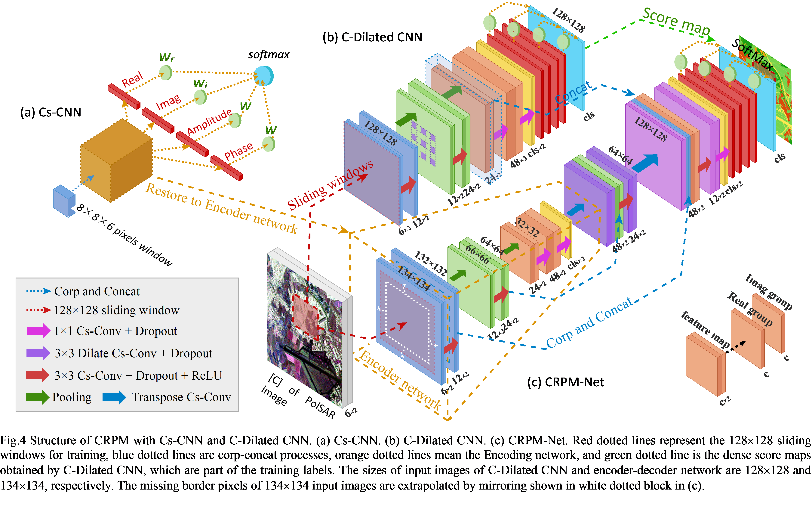
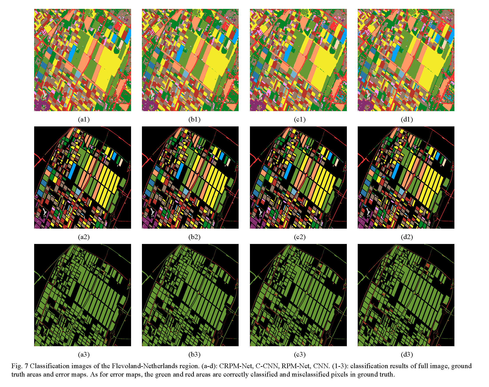
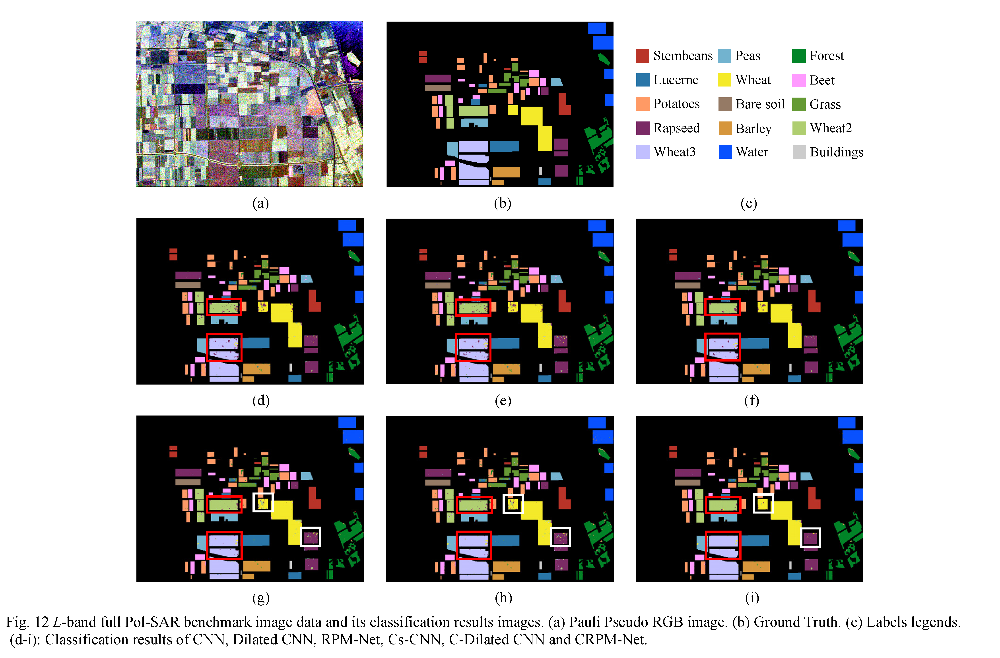

# Pixel-Refining Parallel Mapping Network in the Complex Domain (CRPM-Net) 

Tensorflow implementation of CRPM-Net for PolSAR image classification by DongLing Xiao. Paper at https://arxiv.org/abs/1909.10783 .


## Installation

1) Clone this repository.
2) Ensure tensorflow is installed using 
```
//gpu-python2
sudo pip install --ignore-installed --upgrade https://storage.googleapis.com/tensorflow/linux/gpu/tensorflow_gpu-1.2.0-cp27-none-linux_x86_64.whl
//cpu-python2
sudo pip install --ignore-installed --upgrade https://storage.googleapis.com/tensorflow/linux/cpu/tensorflow-1.2.0-cp27-none-linux_x86_64.whl
```
3) Ensure scipy,numpy,PIL,matplotlib are installed.
4) A jupyter note file is available.

## Training

1) use `utils.py` to gain training pixels, the sampling number is required.
```
def get_train_data(data_path,label_path,label_path_local) # get random sampled pixels
get_sample_npy(label_path) # save as *.npy file
```
2) Cs-CNN training step: in `CRPM_Net.py`, change standard to 1; in `main.py`, chage mode to `train`
```
python main.py
```
```
****************epoch start****************
10 / 89 batch(s) processed in 1th epoch used 4 sec and loss is 0.3314
20 / 89 batch(s) processed in 1th epoch used 0 sec and loss is 0.5463
30 / 89 batch(s) processed in 1th epoch used 0 sec and loss is 0.6430
40 / 89 batch(s) processed in 1th epoch used 0 sec and loss is 0.5983
50 / 89 batch(s) processed in 1th epoch used 0 sec and loss is 3.5854
60 / 89 batch(s) processed in 1th epoch used 0 sec and loss is 0.5164
70 / 89 batch(s) processed in 1th epoch used 0 sec and loss is 0.4983
80 / 89 batch(s) processed in 1th epoch used 0 sec and loss is 0.5076
2019-01-21 12:19:46.082378 >> 1 epoch(s), 89 step(s)
grass: 0.736667
flax: 0.000000
potato: 0.323432
wheat: 0.000000
rapessed: 0.770833
beet: 0.000000
barley: 0.000000
peas: 0.000000
maize: 0.000000
bean: 0.000000
fruit: 0.477778
onion: 0.000000
oat: 0.000000
lucerne: 0.000000
building: 0.000000
road: 0.000000
**********validation evaluation**********
Validation >> 89th step in 1 epoch(s) / Accuracy:  0.2458 / Loss: 4.7863
global_step: 89

```
3) CRPM-Net training step: in `CRPM_Net.py`, change standard to 2; in `main.py`, chage mode to `train`
```
python main.py
```


## Testing

1) test Cs-CNN: in `CRPM_Net.py`, change standard to 1; in `main.py`, chage mode to `test1`

2) test C-Dilated CNN: in `CRPM_Net.py`, change standard to 1; in `main.py`, chage mode to `dilate`

3) testCRPM-Net: in `CRPM_Net.py`, change standard to 2; in `main.py`, chage mode to `test2`

```
python main.py
```

4) Test jupyter notebook  [CRPM_Net_flevoland.ipynb](https://github.com/PROoshio/CRPM-Net/blob/master/CRPM_Net_flevoland.ipynb)


## Classification results
### - Flevoland-Netherlands, AIRSAR, L,P,C-Band

### - Benchmark Flevoland AIRSAR, L-Band



